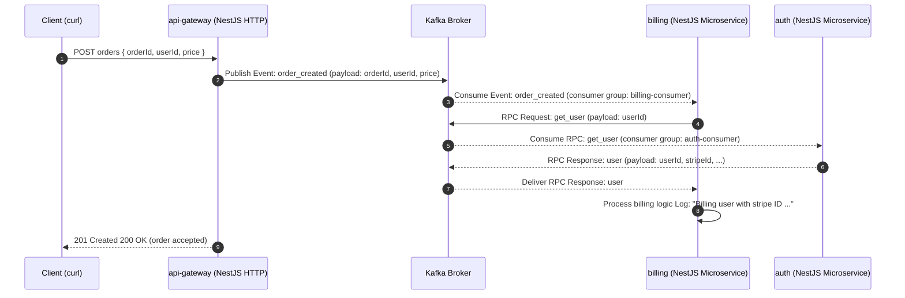

# Event-Driven POC (NestJS + Kafka)

POC for asynchronous communication between microservices using Kafka as the message broker and NestJS Microservices as the application framework.

This repository contains three independent applications that execute a complete end-to-end workflow triggered via HTTP.

## Get Started

For demonstration purposes, a `~/projects` directory was created as the working root. You may use any directory structure you prefer—just adjust the commands accordingly.

## Running the Application

Open three terminal sessions and start each service independently.

1. api-gateway

```bash
cd api-gateway
npm install
npm run start
```

2. billing

```bash
cd billing
npm install
npm run start
```

3. auth

```bash
cd auth
npm install
npm run start
```

### Create an Order (Trigger the Flow)

```bash
curl -X POST http://localhost:3000/orders \
  -H "Content-Type: application/json" \
  -d '{
    "orderId": "123",
    "userId": "daniel",
    "price": "12.3"
  }'
```

### Architecture

#### Services

- api-gateway
  - Exposes POST /orders
  - Publishes the order_created event to Kafka

- billing
  - Consumes the order_created event
  - Requests user information from auth using Kafka request/response
  - Logs the result, simulating a billing/charging operation

- auth
  - Responds to get_user requests with an in-memory (mocked) user
  - Logs the resolved user information

#### Kafka Topics / Messaging Patterns

##### Topics

- order_created (event)

- get_user (request/response)

##### Consumer Groups (current)

- billing-consumer

- auth-consumer

### Workflow (Happy Path)

1. POST /orders (api-gateway)

2. order_created event is published

3. billing consumes order_created

4. billing sends a get_user request

5. auth responds to get_user

6. billing logs:
   Billing user with stripe ID ... a price of $...



Important

- order_created is implemented as an event (emit + @EventPattern)

- get_user is implemented as RPC over Kafka (send + @MessagePattern)

### Expected Logs

#### api-gateway

Publication of the order_created event
(internally creates an OrderCreatedEvent)

#### billing

Received order_created event with data: ...

Billing user with stripe ID ... a price of $...

#### auth

Returning user for userId

## Repository Structure

```md
.
├── api-gateway/
├── billing/
└── auth/
```

Each directory is an independent NestJS project with its own package.json.

### Prerequisites

- Node.js (recommended version 18+)
- Docker & Docker Compose
- NestJS CLI

```bash
npm install -g @nestjs/cli
```

- Kafka

Simple configuration:

```bash
docker run -p 9092:9092 apache/kafka-native:4.0.0
```

Complex configuration:

```bash
docker-compose -f docker-compose-kafka.yml up
```
